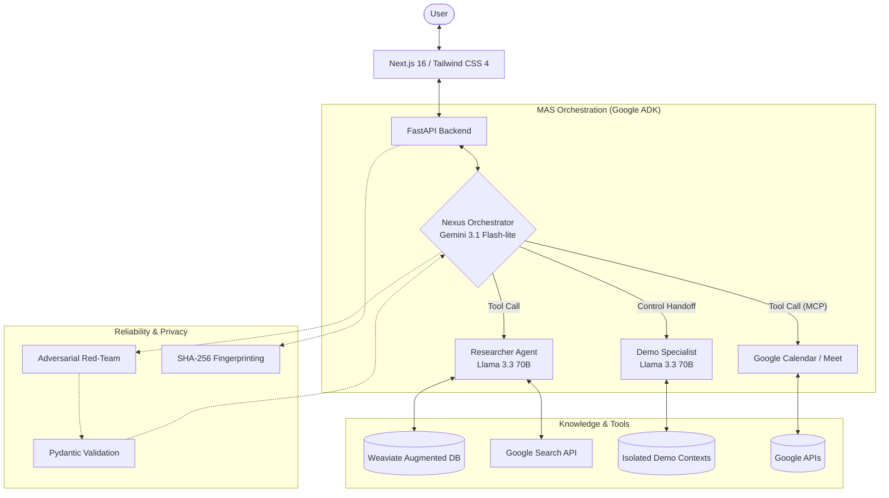

# Project Mirror

## Demo

   

*Short walkthrough demonstrating multi-agent coordination, task execution, and real workflow automation.*

---

## Overview

**Project Mirror** is a multi-agent AI system designed to act as a professional assistant—handling tasks such as information retrieval, scheduling, and technical reasoning through coordinated agent workflows.

It is built to explore how AI systems can move beyond isolated capabilities into **reliable, task-oriented tools used in real workflows**, where outputs directly influence decisions and actions.

---

## What This Solves

Most AI systems work well in isolation (chat, retrieval, automation), but struggle when combined into reliable, end-to-end workflows.

Project Mirror addresses this by:

* Coordinating multiple specialized agents to handle complex, multi-step tasks
* Integrating with external tools (e.g., Google Calendar, Google Meet) to perform real actions
* Enforcing structured outputs and validation to improve reliability
* Providing visibility into system behavior and failure modes

---

## System Architecture

Project Mirror uses a hierarchical multi-agent architecture with a **lean 3-agent core**, designed to balance modularity with latency.

### Core Agents

- **Nexus (Orchestrator)**  
  Handles intent parsing, task decomposition, and execution.  
  Also directly performs certain tasks (e.g., scheduling, technical reasoning) to reduce unnecessary delegation.

- **Researcher (RAG Agent)**  
  Retrieves and grounds responses using Weaviate and external search APIs, with strict context isolation.

- **Demo Specialist**  
  Handles sandboxed scenarios (e.g., customer support, data analysis) using controlled datasets.

---

### Key Design Decision: “Zero-Hop Execution”

Earlier versions used deeper delegation chains across multiple agents.

The current system introduces a **“zero-hop” execution model**, where:
- The orchestrator handles certain tasks directly  
- Delegation is used only when necessary  

This reduces latency, cost, and error propagation while maintaining modularity where it matters.

---

---

## Key Engineering Challenges & Trade-offs

### 1. Modularity vs. Latency

Multi-agent systems introduce coordination overhead.
The shift to a leaner architecture and selective delegation reduces unnecessary inference steps.

---

### 2. Reliability vs. Flexibility

LLMs introduce non-determinism and failure modes.

A multi-layered approach was implemented:

* Retrieval grounding with confidence thresholds
* Adversarial validation (red-team logic checks)
* Structured outputs (Pydantic) to enforce correctness and ensure consistency

This significantly improved output reliability in evaluation environments.

---

### 3. Privacy & Session Management

Maintaining continuity without storing sensitive data:

* Salted SHA-256 hashing for identity tracking
* Summarized session memory ("conversation ghosting")
* No raw PII storage

---

### 4. Multi-Context Data Isolation

Ensuring separation between:

* Personal/professional knowledge
* Simulated/demo datasets

Achieved through strict collection-level isolation in Weaviate.

---

## Results

* Reduced complex workflow execution time from **hours to minutes**
* Significant reduction in logical errors through validation, grounding and adversarial testing
* Improved cost efficiency via dynamic model routing and reduced redundant inference steps
* Reduced latency and token usage through architecture simplification

---

## Tech Stack

**Backend**

* Python 3.11, FastAPI
* Google Agent Development Kit (ADK)
* Model Context Protocol (MCP)

**AI / LLMs**

* Gemini 3.1 Flash-lite
* Llama 3.3 70B (via Groq)
* Qwen 3:30B (via Ollama)

**Data**

* Weaviate (vector database)
* SQLite (metrics and anonymized tracking)

**Frontend**

* Next.js (React), TypeScript
* Tailwind CSS, Framer Motion

**Infrastructure**

* Docker, Docker Compose
* GitHub Actions
* Vercel

---

## Notes

This is an actively evolving system focused on improving reliability, usability, and real-world applicability of multi-agent AI workflows.
