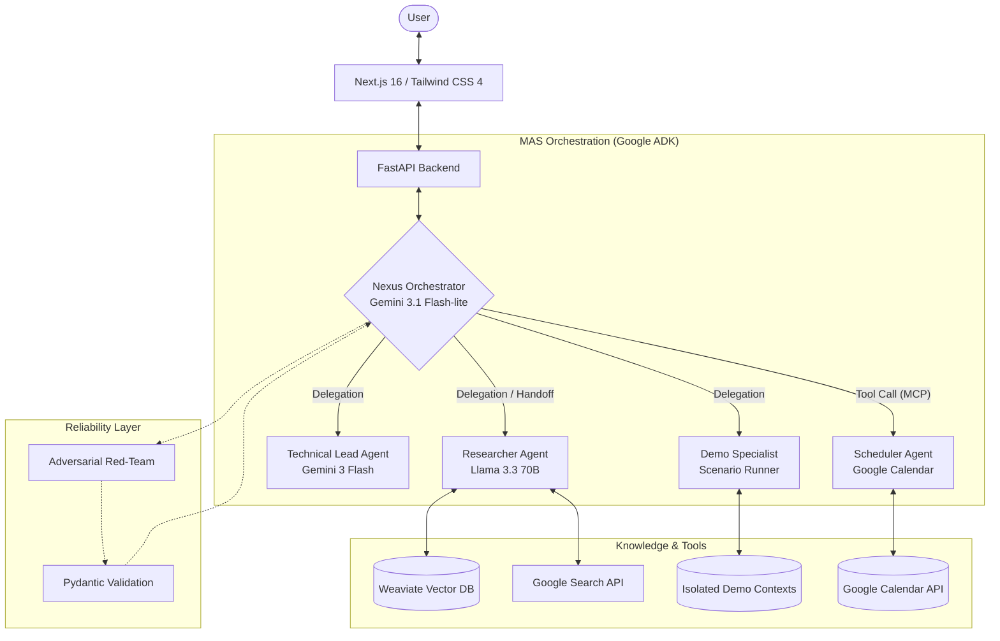

# Project Mirror

## Demo

   

*Short walkthrough demonstrating multi-agent coordination, task execution, and real workflow automation.*

---

## Overview

**Project Mirror** is a multi-agent AI system designed to act as a professional assistant—handling tasks such as information retrieval, scheduling, and technical reasoning through coordinated agents.

It is built to demonstrate how AI systems can move beyond prototypes into **reliable, task-oriented tools used in real workflows**, where outputs directly influence decisions and actions.

---
## System Architecture: The "Nexus-Specialist" Pattern
Project Mirror employs a hierarchical orchestration pattern where a high-reasoning "Nexus" agent manages a fleet of specialized sub-agents.

---
## What This Solves

Most AI projects demonstrate isolated capabilities (chat, retrieval, or automation), but struggle to integrate them into systems that are reliable and usable in practice.

Project Mirror addresses this by:

* Coordinating multiple specialized agents to handle complex, multi-step tasks
* Integrating with external tools (e.g., Google Calendar, Google Meet) to perform real actions
* Enforcing structured outputs and validation to improve reliability
* Providing observability into system behavior and failure modes

---

## System Architecture

Project Mirror uses a hierarchical multi-agent architecture, where a central orchestrator coordinates specialized agents based on task requirements.

### Core Components

* **Orchestrator (Nexus)**
  Parses user intent, decomposes tasks, and routes execution across agents.

* **Research Agent (RAG)**
  Handles retrieval using a vector database (**Weaviate**) with strict context isolation.

* **Technical Agent**
  Performs system design reasoning, trade-off analysis, and structured explanations.

* **Demo / Simulation Agent**
  Runs sandboxed scenarios for domain-specific workflows (e.g., customer support, data analysis).

* **Scheduler Agent**
  Integrates with Google Calendar and Google Meet via **Model Context Protocol (MCP)** to perform real-time scheduling.

---

## Key Engineering Challenges & Trade-offs

### 1. Modularity vs. Latency

Multi-agent systems introduce coordination overhead.
To mitigate this, the system uses a **control-handoff model** for certain flows, reducing unnecessary orchestration steps and improving response time.

---

### 2. Reliability vs. Flexibility

LLMs introduce non-determinism and failure modes.

A multi-layered approach was implemented:

* Retrieval confidence thresholds for grounding
* Adversarial "red-team" validation to detect inconsistencies
* Structured outputs (Pydantic) to enforce correctness

This significantly improved output reliability in evaluation environments.

---

### 3. Privacy & Session Management

Maintaining continuity without storing sensitive data:

* Salted SHA-256 hashing for identity tracking
* Summarized session memory ("conversation ghosting")
* No raw PII storage

---

### 4. Multi-Context Data Isolation

Ensuring separation between:

* Personal/professional data
* Simulated/demo datasets

Achieved through strict collection-level isolation in Weaviate.

---

## Results

* Reduced complex workflow execution time from **hours to minutes**
* Significant reduction in logical errors through validation and adversarial testing
* Improved cost efficiency via dynamic model routing and reduced redundant inference steps

---

## Tech Stack

**Backend**

* Python 3.11, FastAPI
* Google Agent Development Kit (ADK)
* Model Context Protocol (MCP)

**AI / LLMs**

* Gemini 3.1 Flash lite
* Llama 3.3 70B (via Groq)
* Qwen 3:30B (via Ollama)

**Data**

* Weaviate (vector database)
* SQLite (metrics and anonymized tracking)

**Frontend**

* Next.js (React), TypeScript
* Tailwind CSS, Framer Motion

**Infrastructure**

* Docker, Docker Compose
* GitHub Actions
* Vercel

---

## Repository

Project overview and supporting documentation:
[https://github.com/Hou-dini/project-mirror-overview](https://github.com/Hou-dini/project-mirror-overview)

---

## Notes

This is an actively evolving system focused on improving reliability, usability, and real-world applicability of multi-agent AI workflows.
